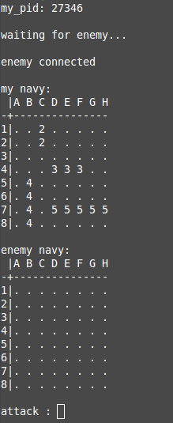

# PSU_2015_navy
Jeu navy en C utilisant les signaux pour échanger des informations

# Compilation
`make re`

# Usage
## Serveur
`./navy positions.txt`

## Client
`./navy [pid serveur] positions.txt`

## Aperçu
